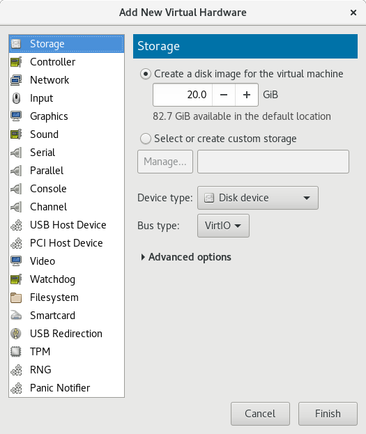

# Gestió de volums Lògics

####    -Descripció del que són:
 Logical Volume Manager es una implementación de un administrador de volúmenes lógicos para el kernel Linux. Se escribió originalmente en 1998 por Heinz Mauelshagen, que se basó en el administrador de volúmenes de Veritas usado en sistemas HP-UX.
####     -Què volen dir les sigles, definició, analogies i exemples de comandes (explicant què fan) vistes a classe de:
####         -PV
Volúmenes físicos (PV): Son las particiones del disco duro con sistema de archivos LVM. 
####         -VG
Grupos de volúmenes (VG): es la parte superior de la LVM. Es la "caja" en la que tenemos nuestros volúmenes lógicos (LV) y nuestros volúmenes físicos (PV). Se puede ver como una unidad administrativa en la que se engloban nuestros recursos. Hay que hacer notar que mientras un PV no se añada al VG, no podemos comenzar a usarlo.

####         -LV
Volúmenes lógicos (LV): es el equivalente a una partición en un sistema tradicional. El LV es visible como un dispositivo estándar de bloques, por lo que puede contener un sistema de archivos (por ejemplo /home)

####     -Entorn de pràctiques: Explicar com farem la pràctica detalladament (màquina virtual i afegir tres discs de 200M)  
Lo que haremos será abrir el virt-manager para crear la maquina virtual y despues en los detalles virtuales de hardware, que entramos allí clicando la bombilla que hay en la parte de arriba y luego clicamos Add Hardware y en Storage ponemos el tamaño que queremos que tenga el dico y en Bus type ponemos la opcion VirtIO, luego finish y hacer el mismo proceso 2 veces mas para acabar agregando los tres discos de 200M.

####     -Pràctica 1: Creació d'un volum lògic a partir d'un dels tres discs durs (vda per exemple). Aquest volum lògic ha de ser del total de capacitat del disc. El volum de grup s'ha de dir practica1 i el volum lògic dades.  
Primero identificamos el disco con el comando:  
##### pvcreate /dev/vdb  
Para comprobar que el PV se ha creado utilizamos el comando:  
##### pvs
Para crear el volumen del grupo y llamarlo practica1 usamos el comando:  
##### vgcreate practica1 /dev/vdb  
Comprobamos que se haya creado con el comando:  
pvs  
Para crear el volumen logico con el nombre dades y que ocupe toda la capacidad del disco usamos el comando:  
##### lvcreate -l +100%FREE -n dades practica1

####     -Pràctica 2: Creació d'un sistema de fitxers xfs al volum lògic creat i muntatge a /mnt. També s'ha de crear un fitxer amb dd de 180MB.  
Para crear el sistema de ficheros xfs utilizamos el comando:  
##### mkfs.xfs /dev/practica1/dades  
Y para montarlo:  
##### mount /dev/practica1/dades /mnt 
Para crear un fichero con dd de 180MB:
##### dd if=dev/zero of=test.img bs=1k count=180000

####     -Pràctica 3: Creació d'un RAID 1 als dos discos sobrants (vdb i vdc per exemple).  
Para hacer las creaciones de un RAID 1 en vdb utilizamos el comando: 
##### mdadm create /dev/md0 --level1=mirror --raid-devices=1 /dev/vdb  
Y para crear otro en vdc utilizamos el comando:  
##### mdadm create /dev/md0 --level1=mirror --raid-devices=1 /dev/vdc
####     -Pràctica 4: Ampliació del volum lògic de dades al raid.    

####     -Pràctica 5: Ampliació del sistema de fitxers xfs al tamany actual del volum lògic dades (s'ha de poder fer sense desmuntar-lo de /mnt ja que és xfs). Una vegada creat crearem un nou fitxer de 180M.
